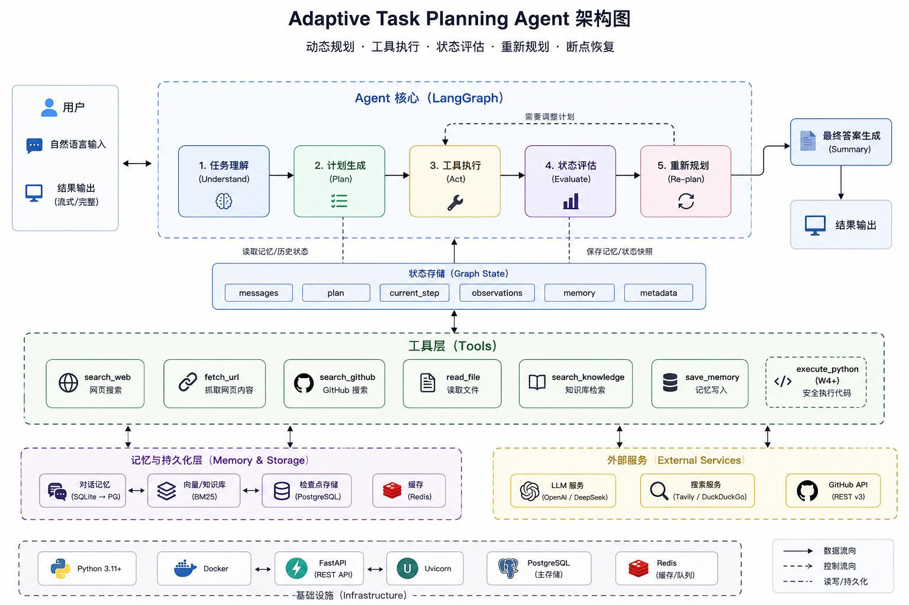

# Adaptive Task Planning Agent

> 面向复杂技术任务的可动态重规划 Agent：任务拆解 → 工具执行 → 状态评估 → 动态重规划 → 断点恢复 → 人工审批，附带 100 条评测集的 Fixed vs Adaptive 对照实验。

**技术栈**：Python · LangGraph · DeepSeek（OpenAI 兼容）· Pydantic · FastAPI + SSE · PostgreSQL · Docker · pytest

## 它解决什么问题

普通 Agent 是"计划一次、闷头执行到底"。本系统的核心机制是**计划可以被执行证据修改**：

- **Planner** 用结构化输出把模糊目标拆成带工具绑定的任务清单；
- **Executor** 逐个调用工具，瞬时故障自动指数退避重试；
- **Evaluator** 判定每个任务是否"真正达成意图"（工具没报错 ≠ 成功）；
- **Replanner** 在信息缺口出现时增量修改计划（已完成任务强制保留，3 次熔断防死循环）；
- 危险操作（execute_python）走 **HITL**：AST 白名单 + 人工审批 + 否决终审。

## 架构



## 评测结果（100 条数据集，每模式 2 遍取均值）

| 指标 | Fixed | Adaptive |
|---|---|---|
| Task Success Rate | 96% | **97%** |
| Tool Call Accuracy | 见 [评测报告](docs/experiments.md) | |
| Plan Completion Rate | 87% | 92% |
| Re-plan Rate | 0% | 48% |
| Tokens / run | 27,967 | 43,655 |
| 单遍成本（DeepSeek 空闲价） | ¥6.0 | ¥9.5 |

**诚实结论**：在易/中任务为主的通用调研任务分布上，两者成功率打平（逐题配对 3:3）——
Adaptive 的价值是**保险而非免费午餐**：收益集中在"首拆计划失效"的场景，
代价是 1.59 倍成本。完整分析（含失败归因与评估器校准）见
[docs/experiments.md](docs/experiments.md)，评估器经 20 份盲测人工校准（一致率 85%）。

## 快速开始

### 方式一：Docker（推荐，含 PostgreSQL）

```bash
# 1. 准备 .env（三把钥匙）
cat > .env << 'EOF'
DEEPSEEK_API_KEY=sk-xxx
GITHUB_TOKEN=github_pat_xxx
TAVILY_API_KEY=tvly-xxx
EOF

# 2. 一条命令起全套（API + PostgreSQL）
docker compose up --build

# 3. 打开 Web 界面
# http://127.0.0.1:8000
```

### 方式二：本地开发（uv + SQLite）

```bash
uv sync
cp .env.example .env    # 填入三把钥匙
uv run uvicorn app.api.main:app --port 8000
```

### 命令行模式（无需浏览器）

```bash
uv run python main.py "分析 langchain-ai/langgraph 仓库并找中文教程"

# 中断后恢复（Checkpoint 断点续跑）
uv run python main.py --resume <run_id>
```

### 跑评测（复现实验）

```bash
uv run python -m evals.run --mode adaptive     # 全量 100 条，约 1.5h
uv run python -m evals.judge --results-dir results/<目录>   # LLM-as-judge 阅卷
uv run python -m evals.calibrate make --n 20 --only-fails   # 人工盲测校准
uv run python -m evals.evaluate                # 生成对比报告
```

## 技术取舍

| 决策 | 选择 | 放弃 | 一句话理由 |
|---|---|---|---|
| 范式 | Plan-and-Execute | ReAct 全循环 | 控制流显式可调试，模型只管节点内决策 |
| 结构化输出 | function calling 路线 | json_schema 响应格式 | 实测兼容性更好（DeepSeek 思考模式不支持后者） |
| 重试 | 指数退避，只重试瞬时故障 | 盲目重试 | 404/参数错重试一万次也没用 |
| Checkpointer | SQLite → Postgres 渐进 | 一开始就 PG | 同一接口零逻辑替换，验证了抽象 |
| 记忆检索 | BM25 + jieba | 向量数据库 | 可解释、零基础设施；语义检索留给 RAG 项目 |
| HITL | interrupt + 人工否决终审 | 自动放行 | 人的否决必须是终审，否则审批是橡皮图章 |
| 评估 | rubric + LLM-as-judge + 盲测校准 | 精确匹配 | 生成类任务没有唯一正确答案 |

完整决策记录（D1~D9）与风险预案见开发过程文档。

## 已知局限（如实声明）

- judge 校验"要点命中"而不校验事实真伪，自洽的幻觉可能得分（已通过人工抽检缓解）；
- Retry 统计盲区：重试发生在包装器内，尚未回写状态字段；
- eval 规模 100 条，±3pp 内差异不具统计显著性。

## 项目结构

见 [docs/experiments.md](docs/experiments.md)（评测报告）、[docs/devlog.md](docs/devlog.md)（六周开发实录，含全部踩坑记录）。

```
app/
├── agent/     # planner / executor / evaluator / replanner / human_gate / final_answer / graph
├── tools/     # 注册表 + run_tool 包装器 + 7 个工具实现
├── models/    # Pydantic 数据模型（Task/Observation/EvaluationResult/Plan/AgentState）
├── memory/    # save_memory + search_knowledge（BM25）
└── api/       # FastAPI + SSE + 静态 UI
evals/         # 数据集 / runner / judge / 校准 / 指标
docs/          # devlog（六周实录）/ experiments.md（评测报告）/ traces
```
